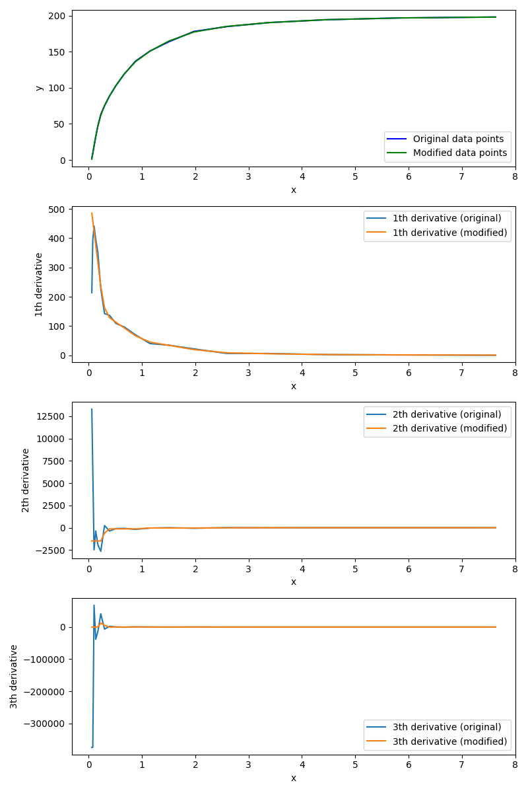

## Monotonic Derivative - A Python Library

Monotonic Derivative is a Python library designed to modify real-life data to ensure that the specified degree derivative of the cubic spline is always monotonically increasing or decreasing. This library can be particularly useful in applications where the derivatives of the given data must follow specific monotonicity constraints, such as in scientific modeling or engineering applications.

### Table of Contents

- [Installation](#installation)
- [Usage](#usage)
- [Example](#example)
- [Real-life Applications](#real-life-applications)
- [Contributing](#contributing)
- [License](#license)

### Installation

To install the Monotonic Derivative library:

```
pip install monotonic-derivative
```

### Usage

First, import the `ensure_monotonic_derivative` function from the `monotonic_derivative` module:

```python
from monotonic_derivative import ensure_monotonic_derivative
```

The primary function of the library, `ensure_monotonic_derivative`, takes the following arguments:

- `x`: numpy array, the independent variable data points
- `y`: numpy array, the dependent variable data points
- `degree`: int, the degree of the derivative to check for monotonicity (default: 2)
- `force_negative_derivative`: bool, force the specified degree derivative to be monotonically decreasing if True (default: False)
- `verbose`: bool, print additional information if True (default: False)
- `save_plot`: bool, save the plots as PNG images if True (default: False)

The function returns a modified numpy array of dependent variable data points (`modified_y`) that satisfy the specified monotonicity constraints.

### Example

```python
import numpy as np
from monotonic_derivative import ensure_monotonic_derivative

x = np.array([0, 1, 2, 3, 4, 5])
y = np.array([100, 55, 53, 40, 35, 5])

modified_y = ensure_monotonic_derivative(
    x, y, degree=2, force_negative_derivative=True, verbose=True, save_plot=True)
```

#### Result :

We got a new curve that follow one rule : The Xth degree (depending of paramter degree) derivate must be increasing/decreasing (depending of force_negative_derivative parameter) curve.

```
#from
y = [100, 55, 53, 40, 35, 5]
#to
modified_y = [99.78638543 56.7089208  48.94131484 44.05868538 33.29107987  5.21361543]
```

As you can see, slight change on y can totaly change how react the 2rd derivate.



### Real-life Applications

In many real-life scenarios, the collected data may produce curves that are not logical or do not follow the expected constraints. For example, the data representing the velocity of a car over time should show an increasing or decreasing acceleration, but due to measurement errors or other factors, the collected data points may not reflect this.

The Monotonic Derivative library offers an easy solution to slightly modify the data to respect these constraints. By using this library, you can ensure that the specified degree derivative of the cubic spline is always monotonically increasing or decreasing, making your data analysis more accurate and reliable.

### Limit

There are certain limitations to consider when using this library. For example, if you want to enforce a 2nd-degree monotonic increasing derivative on a curve that already has an originally monotonic increasing 2nd-degree derivative, the modification applied to the original curve will be much more pronounced. In this case, the resulting 2nd-degree derivative will be almost flat, but still slightly increasing.

It's important to remember that the purpose of this library is to modify a curve based on the physical/mathematical reality that the curve represents. When using the monotonic_derivative library, keep in mind that the goal is to create a more realistic or physically plausible representation of the original curve while preserving its essential characteristics. This can be particularly useful in applications where the original data may be subject to noise or other inaccuracies, and a more idealized or smoothed curve is required for analysis or presentation purposes.

### Contributing

We welcome contributions to the Monotonic Derivative library! Please feel free to submit pull requests for bug fixes, new features, or improvements to the code or documentation.

### License

This project is licensed under the MIT License. See the [LICENSE](LICENSE) file for details.
